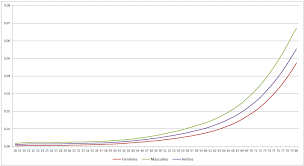

# mortalityAdherence 

<!-- badges: start -->
[](https://github.com/eduardoflm/mortalityAdherence/actions/workflows/R-CMD-check.yaml)
[](https://app.codecov.io/gh/eduardoflm/mortalityAdherence?branch=main)
[](https://opensource.org/licenses/MIT)
[](https://www.r-project.org/)
<!-- badges: end -->

> **Statistical Validation of Mortality/Annuity Tables for Pension Funds**

`mortalityAdherence` is an R package for actuaries who need to assess whether a
biometric mortality/annuity table is statistically consistent with the observed experience
data of a pension fund. It implements **11 statistical tests**, ships with
**10 built-in mortality tables**, and produces clean, formatted results suitable
for actuarial reports and regulatory submissions.

---

## Installation

```r
# Install dependencies
install.packages(c("MASS", "car", "sfsmisc", "remotes"))

# Install from GitHub
remotes::install_url(
  "https://github.com/eduardoflm/mortalityAdherence/archive/refs/heads/main.zip"
)

# Optional extras (HTML output, Excel reading)
install.packages(c("knitr", "kableExtra", "readxl"))
```

---

## Quick Start

```r
library(mortalityAdherence)

# 1. See available built-in tables
listTables()

# 2. Load your pension fund data (CSV, Excel, or data.frame)
fund_data <- loadFundData("experience.csv",
                           col_age = "Age", col_exposed = "Exposed",
                           col_deaths = "Deaths")

# 3. Run all 11 adherence tests
result <- testAdherence(fund_data, table = "AT-2000m", alpha = 0.05)

# 4. Display results
print(result)
result$summary
```

---

## The 11 Statistical Tests

```
┌─────────────────────────────────────────────────────────────────┐
│                  11 ADHERENCE TESTS                             │
├──────────────────────┬──────────────────────────────────────────┤
│ Non-parametric       │  KS  ·  ChiSquare                        │
├──────────────────────┼──────────────────────────────────────────┤
│ Poisson — Type I     │  WaldI_P  ·  LRTI_P  (closed-form)       │
│ Poisson — Type II    │  WaldII_P  ·  LRTII_P  (GLM + slope)     │
│ Bayesian             │  BayesCI  (Gamma-Poisson conjugate)      │
├──────────────────────┼──────────────────────────────────────────┤
│ Negative Binomial    │  WaldI_NB  ·  WaldII_NB                  │
│ (overdispersion)     │  LRTI_NB  ·  LRTII_NB                    │
└──────────────────────┴──────────────────────────────────────────┘
```

### Type I vs Type II

| | Detects |
|---|---|
| **Type I** | Overall level mismatch (global A/E deviation) |
| **Type II** | Age-systematic bias (slope in observed vs expected by age) |

### When to use NB tests

Use Negative Binomial tests when your fund has fewer than ~5,000 members,
shows mortality clustering, or when the Poisson dispersion test is significant.

---

## Built-in Mortality Tables

| Table | Description |
|---|---|
| `AT-2000bm` | American Table 2000 — Male Basic (SOA) |
| `AT-2000m`  | American Table 2000 — Male (SOA) |
| `AT-49M`    | American Table 1949 — Male |
| `AT-55m`    | American Table 1955 — Male |
| `AT-83ms`   | American Table 1983 — Male (smoothed) |
| `GAM71m`    | Group Annuity Mortality 1971 — Male (SOA) |
| `GAM83m`    | Group Annuity Mortality 1983 — Male (SOA) |
| `BR-EMS2010`| Brazilian Insur. Mortality Experience 2010 |
| `BR-EMS2015`| Brazilian Insur. Mortality Experience 2015 |
| `BR-EMS2021`| Brazilian Insur. Mortality Experience 2021 |

All tables cover ages **0 – 120** and express annual death probabilities \(q_x\).

---

## Example Output

```
════════════════════════════════════════════════════════════════════════
  mortalityAdherence :: Biometric Table Adherence Test
════════════════════════════════════════════════════════════════════════
  Mortality table   : AT-2000m
  Significance level: 5.0%
  Age groups        : 41
  Total exposed     : 8,423
  Observed deaths   : 65
  Expected deaths   : 63.81
  A/E ratio         : 1.0187  (+1.9%)
────────────────────────────────────────────────────────────────────────

  [ Non-parametric ]
  KS           Kolmogorov-Smirnov                  0.0612       —   [  pass  ]
  ChiSquare    Chi-Square Goodness-of-Fit          37.9200  0.6134  [  pass  ]

  [ Poisson ]
  WaldI_P      Wald Type I (Poisson)                0.1412  0.8877  [  pass  ]
  WaldII_P     Wald Type II — age slope (Poisson)       —   0.9124  [  pass  ]
  LRTI_P       LRT Type I (Poisson)                 0.0200  0.8876  [  pass  ]
  LRTII_P      LRT Type II — age slope (Poisson)    0.1925  0.9083  [  pass  ]
  BayesCI      Bayesian Credibility Interval             —      —   [  pass  ]   → 95% CI: [0.7891, 1.2743]

  [ Negative Binomial ]
  WaldI_NB     Wald Type I (Negative Binomial)      0.1489  0.8817  [  pass  ]
  WaldII_NB    Wald Type II — age slope (Neg. …)        —   0.9401  [  pass  ]
  LRTI_NB      LRT Type I (Negative Binomial)       0.0188  0.8909  [  pass  ]
  LRTII_NB     LRT Type II — age slope (Neg. …)     0.1071  0.9478  [  pass  ]
════════════════════════════════════════════════════════════════════════

  0 of 11 tests reject H₀ at the 5% significance level.
  ✔  GOOD ADHERENCE: the table fits the fund data well.
```

---

## Custom Tables

```r
# Apply a longevity improvement factor of 0.90
adjusted <- loadTable("AT-2000m")
adjusted$qx <- adjusted$qx * 0.90

result <- testAdherence(fund_data, table = adjusted)
```

---

## HTML Tables for Reports

```r
# Returns a kableExtra HTML table — use inside R Markdown or Shiny
htmlTable(result)
```

---

## API Reference

| Function | Description |
|---|---|
| `testAdherence(data, table, alpha)` | Run all 11 tests; returns `adherence_result` |
| `listTables()` | Data frame catalogue of built-in tables |
| `loadTable(name)` | Retrieve a built-in table as `data.frame(age, qx)` |
| `loadFundData(file, ...)` | Read CSV/Excel fund experience data |
| `printResult(x)` | Formatted console output |
| `htmlTable(x)` | Styled HTML table for reports/Shiny |
| `mortality_tables` | Built-in dataset (all 10 tables, ages 0–120) |

---

## Contributing

Contributions are welcome. Please open an issue to discuss proposed changes
before submitting a pull request. All PRs must pass `R CMD CHECK` with no
errors or warnings.

---

## Citation

If you use `mortalityAdherence` in your work, please cite the underlying research paper:

```bibtex
@article{deMelo2026,
  author    = {de Melo, Eduardo Fraga L. and Graziadei, Helton and Targino, Rodrigo},
  title     = {Annuity Table Validation in Pension Funds: A Comparative Power
               Analysis of Goodness-of-Fit Tests},
  year      = {2026},
  month     = {April},
  note      = {SSRN Working Paper},
  url       = {https://papers.ssrn.com/sol3/papers.cfm?abstract_id=6668699},
  pages     = {27}
}
```

Or in plain text:

> de Melo, E.F.L., Graziadei, H. & Targino, R. (2026). *Annuity Table Validation
> in Pension Funds: A Comparative Power Analysis of Goodness-of-Fit Tests.*
> SSRN Working Paper. https://papers.ssrn.com/sol3/papers.cfm?abstract_id=6668699

---

## License

MIT © 2026 mortalityAdherence authors — see [LICENSE](LICENSE) for details.

---

## References

> ### 📄 Primary Reference — Please cite this paper when using mortalityAdherence
>
> **de Melo, E.F.L., Graziadei, H. & Targino, R. (2026).**
> *Annuity Table Validation in Pension Funds: A Comparative Power Analysis of Goodness-of-Fit Tests.*
> SSRN Working Paper. 27 pages. Posted: 28 Apr 2026.
> [https://papers.ssrn.com/sol3/papers.cfm?abstract_id=6668699](https://papers.ssrn.com/sol3/papers.cfm?abstract_id=6668699)
>
> *Affiliations: Universidade do Estado do Rio de Janeiro (UERJ);
> Getulio Vargas Foundation (FGV) — EMAp — School of Applied Mathematics;
> Superintendence of Private Insurance (SUSEP);
> Federal University at Sao Carlos - UFSCar.*

---

### Additional References

- Bowers, N.L. et al. (1997). *Actuarial Mathematics*, 2nd ed. Society of Actuaries.
- Benjamin, B. & Pollard, J.H. (1993). *The Analysis of Mortality and Other Actuarial Statistics*. IoFA.
- London, D. (1985). *Survival Models and Their Estimation*. ACTEX Publications.
- FenaPrevi (2021). *Tábua BR-EMS2021*. Brazil.
